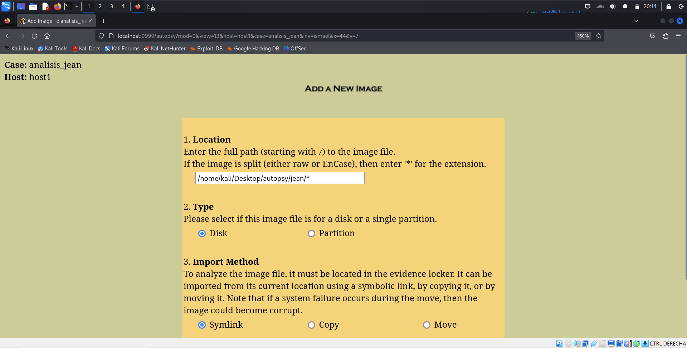

# M57-Jean Ismael Ruiz

## Introducción

M57-Jean es un ejercicio de análisis  forense que simula una filtración de datos en una empresa llamada M57.biz, creado por DigitalCorpora ([Link de referencia](https://digitalcorpora.org/corpora/scenarios/m57-jean/)). Se descubrió una hoja de cálculo confidencial con información sensible de empleados publicada en el foro de soporte técnico de un competidor. La única copia de este archivo estaba en la computadora portátil de la directora financiera, Jean. Jean afirmó no saber cómo los datos salieron de su dispositivo y sugirió que su ordenador había sido hackeado. Se proporcionó una imagen forense de su disco duro para investigar cómo ocurrió la filtración. También sabemos que la mayoría de documentos de la empresa se envían por correo electrónico. El objetivo del ejercicio es determinar si los datos fueron robados y, en caso afirmativo, identificar cómo sucedió.

El documento se denomina `m57biz.xls` y este es su contenido:


## Extracción logs de correo

Como herramienta utilizaré `Autopsy`, orientada al análisis forense digital, que se utiliza para examinar discos duros, móviles y otros dispositivos de almacenamiento en investigaciones legales o de ciberseguridad

Iniciamos la herramienta y se nos levantará un servidor web en el puerto 9999

```
sudo autopsy
```

Seguidamente creamos un nuevo caso especificando el nombre del mismo y los investigadores que van a participar en el análisis


Añadimos el host


Y añadimos la imagen


Especificamos la ubicación donde tenemos el caso almacenado, en este caso al ser dos unidades al final de la ruta especificamos que agarre todo el contenido del directorio



Confirmamos que se han seleccionado bien las imágenes


Establecemos el tipo de sistema de ficheros que se maneja, en este caso `ntfs` y el punto de montaje


Confirmamos 


Seleccionamos la partición ya montada y seleccionamos `Analyze`


Seguidamente ya que sabemos que el fichero fue mandado por correo vamos buscar los logs del cliente de correo, en este caso `Outlook`, que nos da un fichero en formato `.pst` (Personal Storage Table) y lo exportamos


## Análisis de los logs

En un principio estos logs pueden cargarse en la aplicación propia de Outlook de Microsoft, pero me parece mucho más cómodo utilizar la herramienta `readpst` que procesa los logs y nos da como resultado unos ficheros en formato `.mbox`, para poder utilizar `grep` en búsqueda de lo que necesitamos, en vez de tener que ir correo por correo haciendo click perdiendo mucho tiempo.

Instalamos la herramienta que pertenece al paquete `pst-utils`

```
sudo apt install pst-utils
```

Seguidamente le indicamos a la herramienta que nos muentre el proceso `(-D)`, donde almacenará el output `(-o)` , en este caso al directorio `correos_jean` y donde están los logs


```
readpst -D -o correos_jean ~/Downloads/vol2-C..Documents.and.Settings.Jean.Local.Settings.Application.Data.Microsoft.Outlook.outlook.pst
```


Seguidamente con grep indicaremos que busque en todo el contenido de `Sent Items.mbox` la cadena de texto `m57biz.xls`, y con las flags `(-B40)` y `(-A60)` establecemos cuantas líneas de antes y después queremos que se muentren una vez encontrada la coincidencia dando como resultado el correo que necesitamos para determinar que ha pasado

```
grep -B40 -A60 "m57biz.xls" "Sent Items.mbox"
```


Correo completo:

```
----boundary-LibPST-iamunique-1717840645_-_---

From "jean@m57.biz" Sun Jul 20 03:28:47 2008
Status: RO
From: "Jean User" <jean@m57.biz>
Subject: RE: Please send me the information now
To: alison@m57.biz
Date: Sun, 20 Jul 2008 01:28:47 +0000
Message-Id: <NNEEKAKACNPOIIMAAIIKIECBCAAA.jean@m57.biz>
MIME-Version: 1.0
Content-Type: multipart/mixed;
        boundary="--boundary-LibPST-iamunique-1165460941_-_-"


----boundary-LibPST-iamunique-1165460941_-_-
Content-Type: text/plain; charset="iso-8859-1"

I've attached the information that you have requested to this email message.


-----Original Message-----
From: alison@m57.biz [mailto:tuckgorge@gmail.com]
Sent: Sunday, July 20, 2008 2:23 AM
To: jean@m57.biz
Subject: Please send me the information now


Hi, Jean.

I'm sorry to bother you, but I really need that information now --- this VC guy is being very insistent.
Can you please reply to this email with the information I requested --- the names, salaries, and 
social security numbers (SSNs) of all our current employees and intended hires?

Thanks.

Alison
----boundary-LibPST-iamunique-1165460941_-_-
Content-Type: application/octet-stream
Content-Transfer-Encoding: base64
Content-Disposition: attachment; 
        filename*=utf-8''m57biz.xls;
        filename="m57biz.xls"
```

## Resolución del caso

Después de analizar el correo, queda claro que Jean no compartió el archivo con la verdadera Alison, sino que fue víctima de un ataque de phishing, puediéndose ver en esta línea:

```
From: alison@m57.biz [mailto:tuckgorge@gmail.com]
```


Aunque el mensaje parecía legítimo, en realidad provenía de una dirección externa `tuckgorge@gmail.com` que suplantaba la identidad de Alison. Jean, creyendo que se trataba de una solicitud interna urgente, adjuntó y envió el archivo con información sensible. Por tanto, la filtración no fue a causa de una vulnerabilidad, sino de un engaño por ingeniería social al que Jean no supo responder adecuadamente


## Conclusión

Este ejercicio de análisis deja claro que una buena parte de los ataques de hoy día provienen de la ingeniería social y phishing, remarcando la importancia de tener trabajadores bien formados y preparados ante este tipo de situaciones que cada día se sufren en el mundo real.