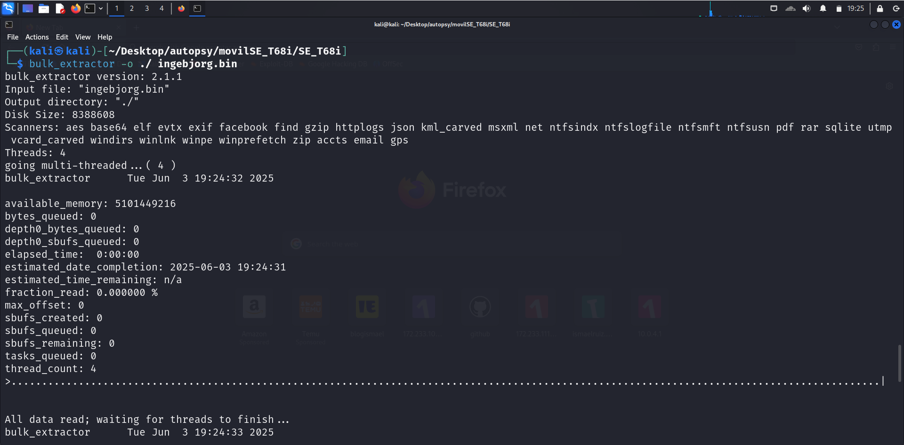
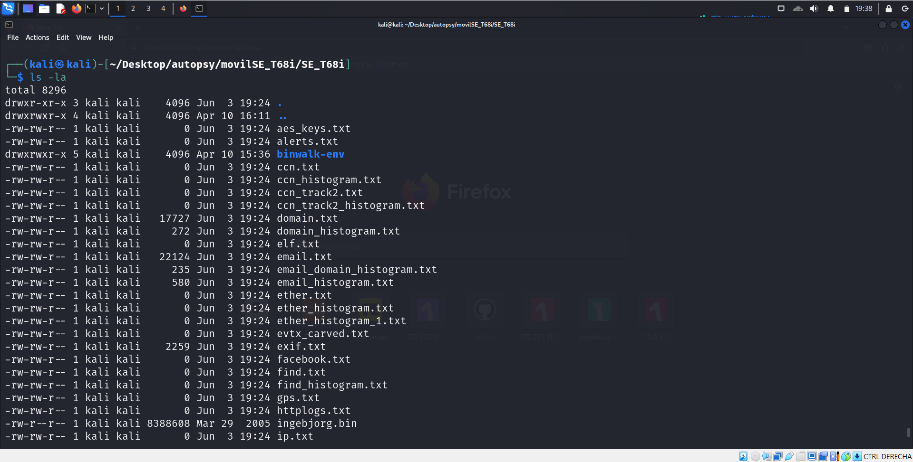
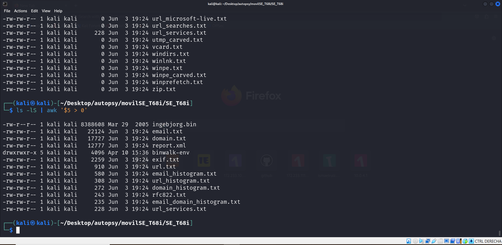

# Análisis forense Nokia T68i

> Url de descarga del binario de Nokia T68i proporcionado por Digital Corpora: [Nokia T68i - Digital Corpora](https://digitalcorpora.org/corpora/cell-phones/])


Lo primero que deberemos hacer es descomprimir el fichero que hemos descargado

```
unzip SE_T68i.zip
```

Y procedemos a extraer el contenido del binario `ingebjorg.bin` con la herramienta `bulk_extractor` indicando la ruta en la que queramos almacenar el output del programa (grave error ponerlo en el mismo directorio en el que estaba trabajando)

```
bulk_extractor -o ./ ingebjorg.bin
```




Una vez extraidos los ficheros del móvil podemos observar que varios de ellos siquiera tienen contendio (posiblemente bulk_extractor indentificó que existe el fichero pero no puede recuperar nada de él)



Podemos limpiar un poco el output de bulk_extractor usando este comando, el cual lista los ficheros en formato detallado, ordenándolos de mayor a menor y haciendo que se muestren únicamente los ficheros los cuales pesen más de 0 b, indicando la columna 5 la cual es el tamaño de dichos ficheros
```
ls -lS | awk '$5 > 0'
```



Ahora podemos echarle un vistazo a el contenido que hemos podido recuperar del Nokia, estos son algunos de los más interesantes:

```
└─$ cat url.txt  
# BANNER FILE NOT PROVIDED (-b option)
# BULK_EXTRACTOR-Version: 2.1.1
# Feature-Recorder: url
# Filename: ingebjorg.bin
# Feature-File-Version: 1.1
5118986 http://mobileinternet.ericsson.com/applications/highscore/upload.asp    -\000--\000%02d\000%03ld\000http://mobileinternet.ericsson.com/applications/highscore/upload.asp\000%s?v=%d&m=%s\00011
5183406 http:// BrowserObj_Edit\000h\000t\000t\000p\000:\000/\000/\000\000\000\001\000m3\001\000n3\001\000o3\001\000
6096018 http://wap.esato.com/wap/#esato s\000\030\000\002\0000\0000\0007\000\030\000\036\000h\000t\000t\000p\000:\000/\000/\000w\000a\000p\000.\000e\000s\000a\000t\000o\000.\000c\000o\000m\000/\000w\000a\000p\000/\000#\000e\000s\000a\000t\000o\000\030\000\012\000K\000l\000i\000n\000g\000e\000
6881299 http://mms/     \000\307z\000\000m\000\000\000\000\000\000\000\000\000\002http://mms/\000\000\000\000\000\000\000\000\000\000\000\000\000\000\000\000
```


```
└─$ cat domain.txt 
# BANNER FILE NOT PROVIDED (-b option)
# BULK_EXTRACTOR-Version: 2.1.1
# Feature-Recorder: domain
# Filename: ingebjorg.bin
# Feature-File-Version: 1.1
4987192 ecs.ericsson.se ristina.ahlgren@ecs.ericsson.se\000J\366rgen Birkler\000
4987238 ecs.ericsson.se \000jorgen.birkler@ecs.ericsson.se\000Lars Novak\000lars
4987276 ecs.ericsson.se ovak\000lars.novak@ecs.ericsson.se\000Maria Rang\000mari
4987314 ecs.ericsson.se Rang\000maria.rang@ecs.ericsson.se\000Magnus Olsson\000m
4987359 ecs.ericsson.se \000magnus.olsson3@ecs.ericsson.se\000Jan Svensson\000ja
4987401 ecs.ericsson.se on\000jan.svensson@ecs.ericsson.se\000G Jennie Holst\000
5090415 ecs.ericsson.se enric.andersson@ecs.ericsson.se\000Kristina Ahlgre
5090465 ecs.ericsson.se ristina.ahlgren@ecs.ericsson.se\000J\366rgen Birkler\000
5090511 ecs.ericsson.se \000jorgen.birkler@ecs.ericsson.se\000Lars Novak\000lars
5090549 ecs.ericsson.se ovak\000lars.novak@ecs.ericsson.se\000Magnus Olsson\000m
5090595 ecs.ericsson.se magnus.s.olsson@ecs.ericsson.se\000Marek Pola\000mare
5090633 ecs.ericsson.se Pola\000marek.pola@ecs.ericsson.se\000Johan Westrom\000j
5090677 ecs.ericsson.se m\000johan.westrom@ecs.ericsson.se\000S\000o\000n\000y\000 \000E\000r\000i
5118993 mobileinternet.ericsson.com     2d\000%03ld\000http://mobileinternet.ericsson.com/applications/hi
6881306 mms     \000\000\000\000\000\000\000\000\002http://mms/\000\000\000\000\000\000\000\000\000\000\000\000\000\000\000
7078646 aerogadget.net  \002\000\030\000\033\000fjp.mobil@aerogadget.net 'fjp.mobil@aero
7078672 aerogadget.net  .net 'fjp.mobil@aerogadget.net'\002\000\005f\005\017\035p\035皇\232\023d
7079036 aerogadget.net  \000\000\000\000\000\000fjp.mobil@aerogadget.net\000\000\000\000\000\000\000\000\000\000\000\000\000\000\000\000
7079341 aerogadget.net  \000\000\000\000\000\000fjp.mobil@aerogadget.net\000\000\000\000\000\000\000\000\000\000\000\000\000\000\000\000
7079646 aerogadget.net  \000\000\000\000\000\000fjp.mobil@aerogadget.net\000\000\000\000\000\000\000\000\000\000\000\000\000\000\000\000
```

```
└─$ cat email.txt
# BANNER FILE NOT PROVIDED (-b option)
# BULK_EXTRACTOR-Version: 2.1.1
# Feature-Recorder: email
# Filename: ingebjorg.bin
# Feature-File-Version: 1.1
4987175 kristina.ahlgren@ecs.ericsson.se        ristina Ahlgren\000kristina.ahlgren@ecs.ericsson.se\000J\366rgen Birkler\000
4987223 jorgen.birkler@ecs.ericsson.se  \000J\366rgen Birkler\000jorgen.birkler@ecs.ericsson.se\000Lars Novak\000lars
4987265 lars.novak@ecs.ericsson.se      n.se\000Lars Novak\000lars.novak@ecs.ericsson.se\000Maria Rang\000mari
4987303 maria.rang@ecs.ericsson.se      n.se\000Maria Rang\000maria.rang@ecs.ericsson.se\000Magnus Olsson\000m
4987344 magnus.olsson3@ecs.ericsson.se  e\000Magnus Olsson\000magnus.olsson3@ecs.ericsson.se\000Jan Svensson\000ja
4987388 jan.svensson@ecs.ericsson.se    se\000Jan Svensson\000jan.svensson@ecs.ericsson.se\000G Jennie Holst\000
5090398 henric.andersson@ecs.ericsson.se        enric Andersson\000henric.andersson@ecs.ericsson.se\000Kristina Ahlgre
5090448 kristina.ahlgren@ecs.ericsson.se        ristina Ahlgren\000kristina.ahlgren@ecs.ericsson.se\000J\366rgen Birkler\000
5090496 jorgen.birkler@ecs.ericsson.se  \000J\366rgen Birkler\000jorgen.birkler@ecs.ericsson.se\000Lars Novak\000lars
5090538 lars.novak@ecs.ericsson.se      n.se\000Lars Novak\000lars.novak@ecs.ericsson.se\000Magnus Olsson\000m
5090579 magnus.s.olsson@ecs.ericsson.se e\000Magnus Olsson\000magnus.s.olsson@ecs.ericsson.se\000Marek Pola\000mare
5090622 marek.pola@ecs.ericsson.se      n.se\000Marek Pola\000marek.pola@ecs.ericsson.se\000Johan Westrom\000j
5090663 johan.westrom@ecs.ericsson.se   e\000Johan Westrom\000johan.westrom@ecs.ericsson.se\000S\000o\000n\000y\000 \000E\000r\000i
7078636 fjp.mobil@aerogadget.net         Lehbrink\000\002\000\030\000\033\000fjp.mobil@aerogadget.net 'fjp.mobil@aero
7078662 fjp.mobil@aerogadget.net        aerogadget.net 'fjp.mobil@aerogadget.net'\002\000\005f\005\017\035p\035皇\232\023d
```