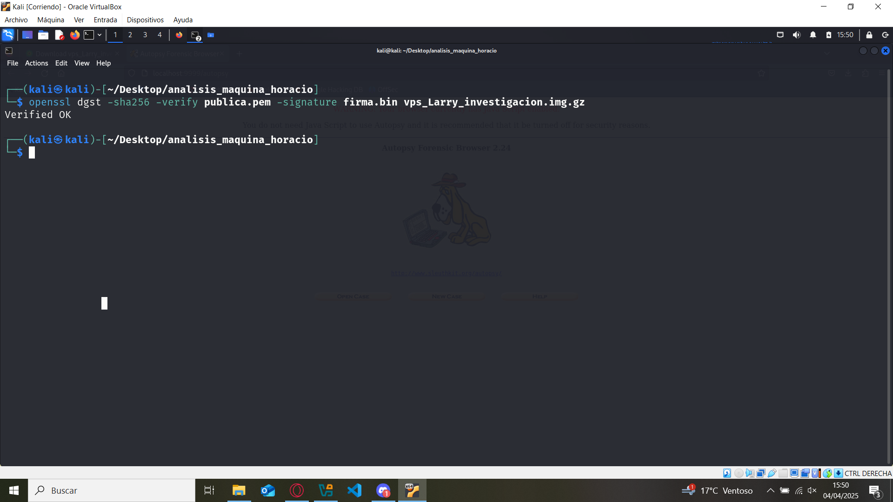
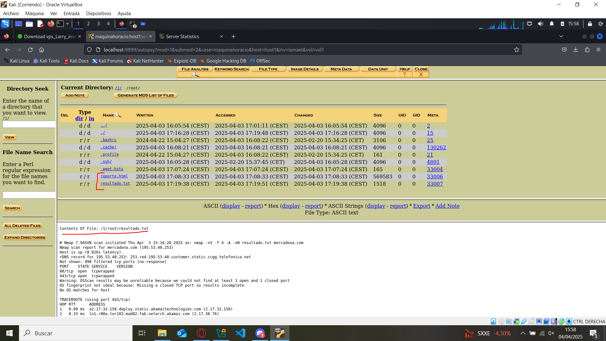
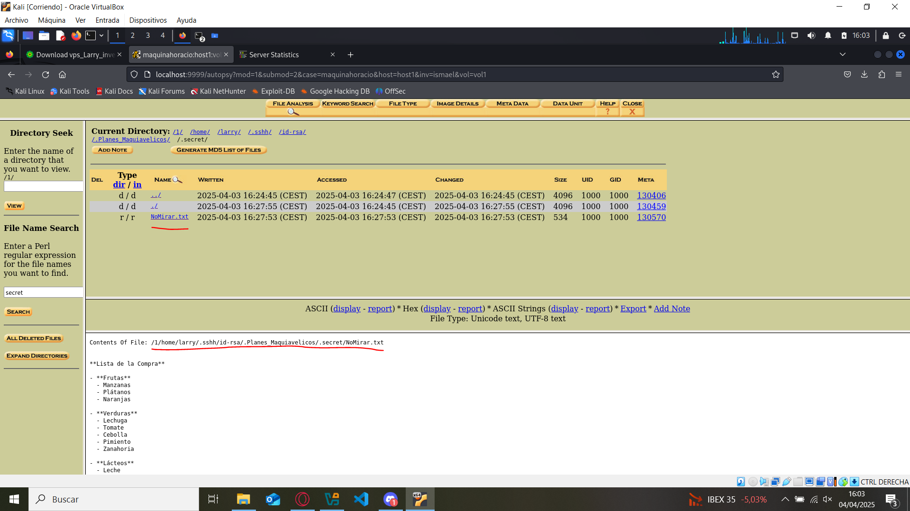
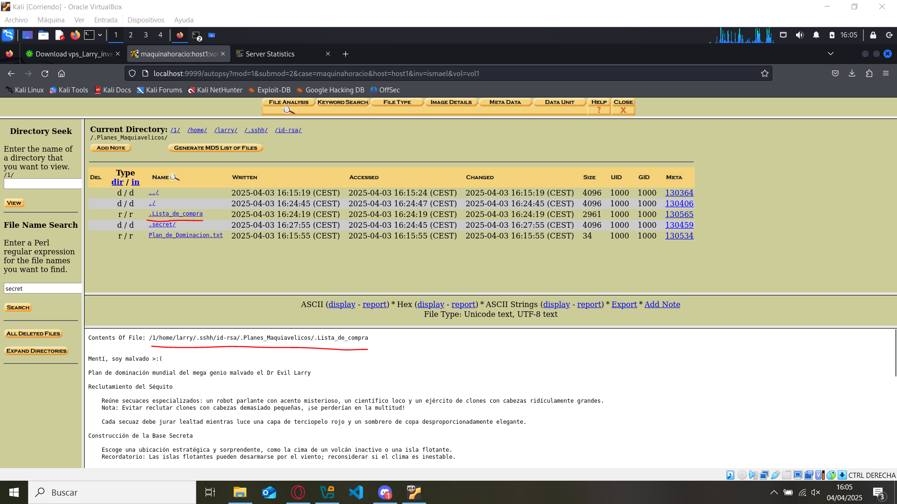
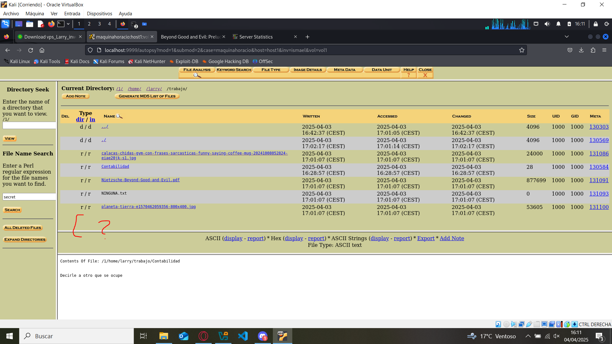
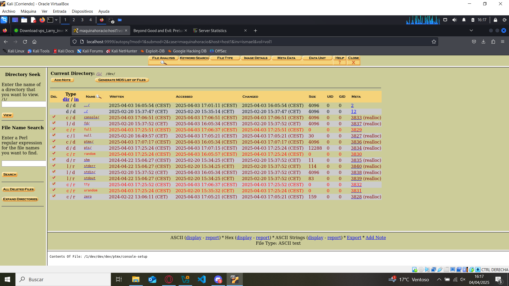
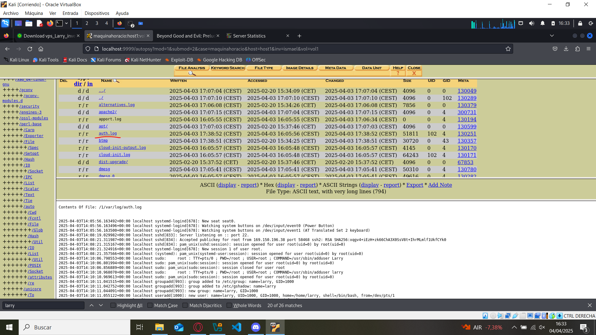
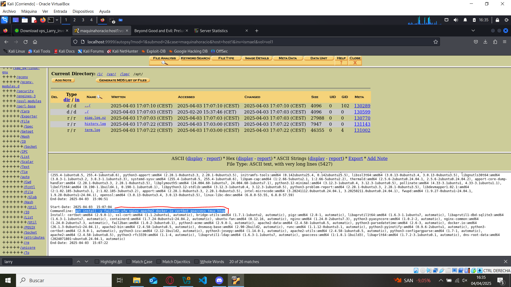

# Análisis de la extración de imagen del VPS de mi compañero Horacio.

## Verificación de firma

> Ubicación de descarga de su imagen, clave pública de la firma, y la firma: https://github.com/Skycstls/imagenes-forensicas-vps/blob/alex/enlaces.txt

Lo primero que debemos de hacer es verificar si la imagen ha sufrido cambios durante la descarga, es de vital importancia para asegurar la integridad y veracidad del análisis

```bash
openssl dgst -sha256 -verify publica.pem -signature firma.bin vps_Larry_investigacion.img.gz
```



Seguidamente, descomprimimos la imagen

```bash
gunzip vps_Larry_investigacion.img.gz
```
Y la abrimos con la herramienta `Autopsy`
```bash
autopsy
```
Abrimos el navegador y accedemos a `localhost` en el puerto `9999` y le indicamos la ubicación de la imagen

## Análisis del VPS

Lo primero que encontré los ficheros `reporte.html` y `resultado.txt` generados por Horacio ubicados en el directorio `/root`, son el resultado de un scaneo a la web de `mercadona.com`



Seguidamente conseguí ubicar varios directorios ocultos hasta encontrar el fichero `NoMirar.txt`, ubicado en `/home/larry/.sshh/id-rsa/.Planes_Maquiavelicos/.secret`, que contiene una lista de la compra




En el directorio previo, `/home/larry/.sshh/id-rsa/.Planes_Maquiavelicos` encontré el fichero oculto `.Lista_de_compra`, que contiene planes muy maquiavélicos



En el directorio `/home/larry/trabajo` deberían haber más contenido de imágenes, pdfs, txt ... Pero ni el propio Autopsy pudo recuperar



Lo que sí recuperó autopsy es que en el directorio `/dev` se borró todo el contenido



Aunque Horacio borrase el historial de comandos de la máquina, pude recuperar el fichero `auth.log` ubicado en `/var/log`, el cual almacena los eventos relacionados con mecanismos de autorización, ya que se conectó mediante `ssh` al usuario `root`, puedo visualizar **todos** los comandos que introdujo



Por último, dentro del directorio `/var/log/apt` pude encontrar el registro de las 9 herramientas que instaló en el VPS




> Nota: A Horacio se le olvidó poner flags en su VPS, por eso no pude encontrar ninguna, eso sí, es un gran villano.