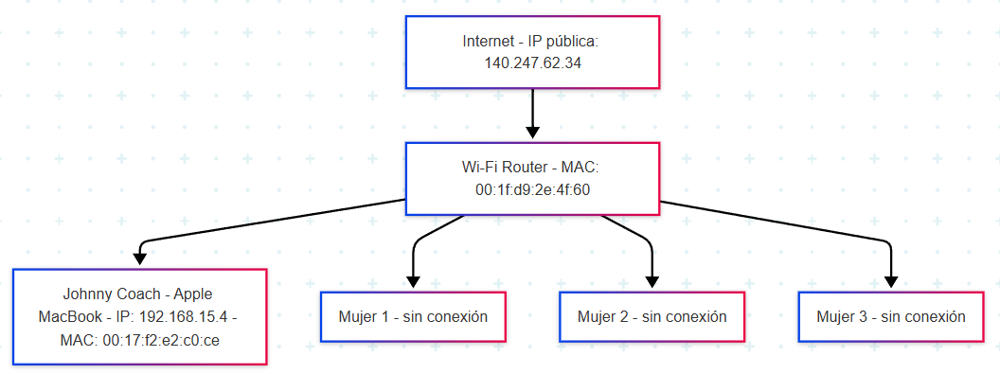
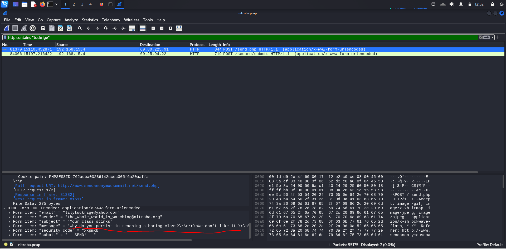
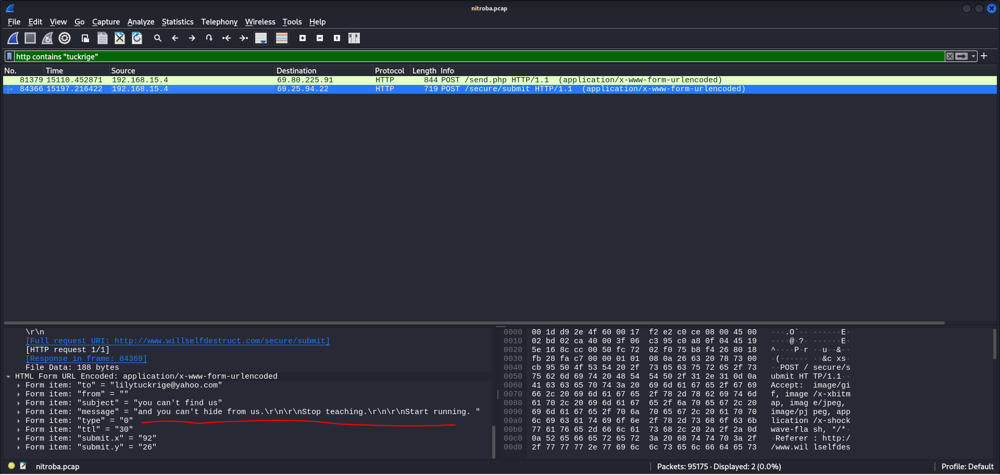
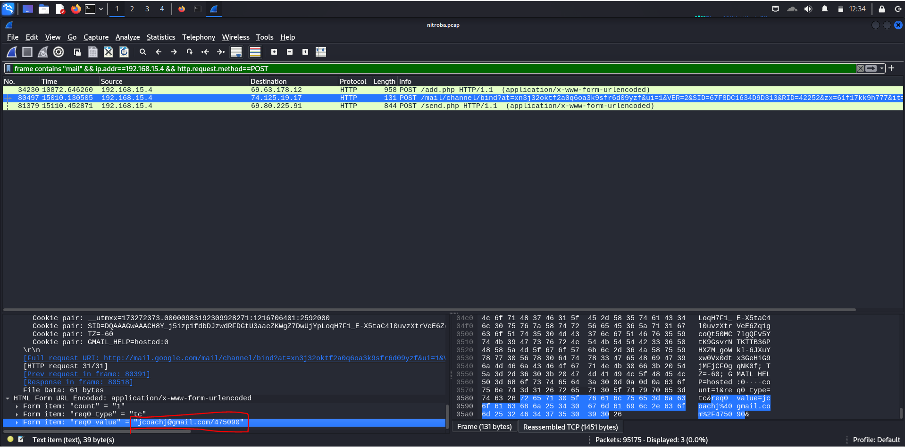
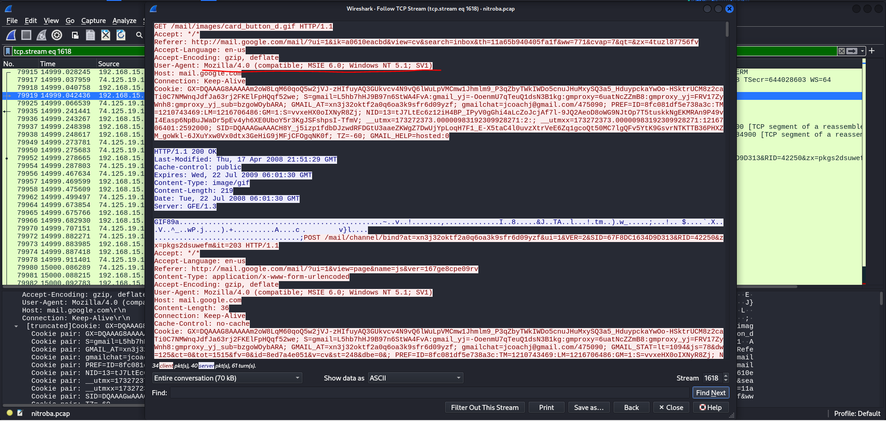

# Nitroba

https://github.com/open-nsm/course/blob/master/pcaps/nitroba.pcap

https://digitalcorpora.org/corpora/scenarios/nitroba-university-harassment-scenario/

## Datos

Una profesora denuncia acoso por email en el campus de la universidad dirigido a ella. La profesora sospecha que es un alumno/a.

El servicio de IT solicita más información acerca del incidente a la profesora, y le solicitan los headers del email.

Desde los headers ven la IP desde la que se envió el email, esta pertenece a una habitación de los alumnos de la universidad.

La habitación es compartida por tres personas:

- Alice
- Barbara
- Candice

Cada habitación tiene conexión ethernet para los alumnos, pero no hay wifi.

*Kenny*, el novio de *Barbara* instaló un router wifi en la habitación.

No hay contraseña en el router.

El equipo IT de nitroba comienza a esnifar paquetes de red esperando que el atacante vuelva a enviar un email desde la red.

---

Tras varios dias, la profesora recibe un email en su cuenta `lilytuckrige@yahoo.com` desde `noreply@willselfdestruct` con el titulo `you can't hide from us`.
Al abrir la url adjunta, una página muestra el siguiente mensaje durante unos segundos y luego desaparece:

```
and you can't hide from us.
Stop teaching.
Start running.
```
---

## POI

Esta es la clase de quimica:

Profesora: 
- Lily Tuckrige

Alumnos:
- Amy Smith
- Burt Greedom
- Tuck Gorge
- Ava Book
- Johnny Coach
- Jeremy Ledvkin
- Nancy Colburne
- Tamara Perkins
- Esther Pringle
- Asar Misrad
- Jenny Kant

## Problemas

1. Mapea la red del dormitorio. Crea un diagrama donde se muestre la red del dormitorio, sus usuarios y los dispositivos conectados.




> Diagrama hecho en [Mermaid](https://mermaid.js.org)

2. Demuestra que persona mandó el email a la profesora, necesitamos un nombre.

Primero vamos a ubicar quien ha enviado emails a la profesora, aplicando el filtro `http contains "tuckrige"`, encontrando los dos mensajes de acoso que recibió la profesora





Para saber quién envió los mensajes de acoso utilicé este filtro: 
```
frame contains "mail" && ip.addr==192.168.15.4 && http.request.method==POST
```
Sirve para encontrar los paquetes que se enviaron por mail, filtrando por la IP del acosador y con el método POST (este último es especialmente útil ya que el mensaje de willselfdestruct lo tuvo que enviar alguien mediante un formulario)



Efectivamente, conseguimos vincular el email `jcoachj@gmail.com` con los mensajes de acoso, por lo que el acosador es `Johnny Coach`, que se aprovechó del router sin contraseña.

3. Encuentra información que pueda enlazar el mensaje a un navegador y sistema operativo.

Para ello, desde el paquete anterior, hacemos `Click derecho -> Follow -> TCP Stream`

Al analizar el `User-Agent` podemos observar que utilizó el navegador Internet Explorer (versión 6.0), que corresponde a `MSIE 6.0` y el sistema operativo Windows XP, que corresponde a Windows XP

