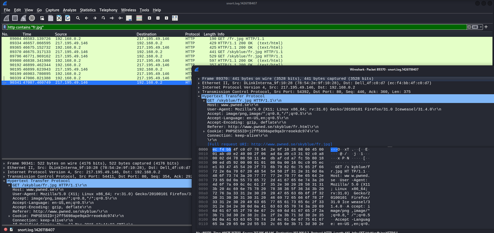
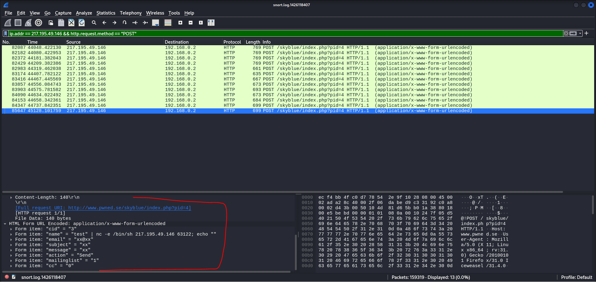
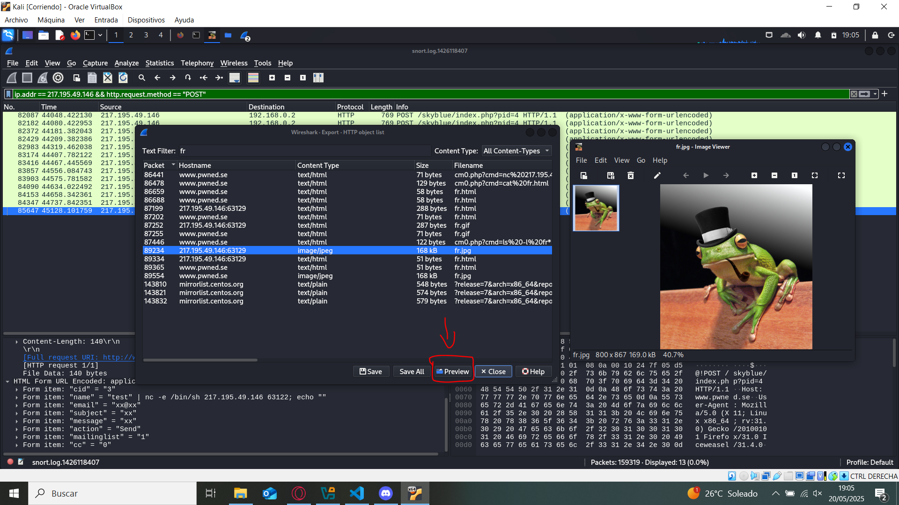
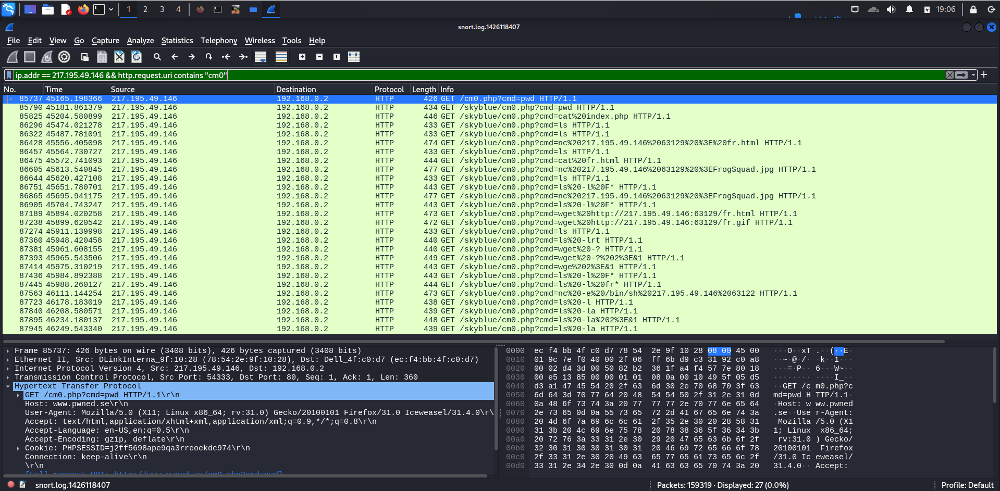

# Ejercicio PCAP Rana
Ubicación de los pcaps: https://share.netresec.com/s/nF5zNcaXLgwdQFZ

Ubicación de los ejercicios: https://share.netresec.com/s/NBbonFnsZ4HqCTW

## 1.1 ¿Qué IP usaron los atacantes?

Filtamos en el buscado de wireshark `http contains "fr.jpg"`

La IP es de los atacantes es `217.195.49.146`

## 1.2 ¿Cómo los atacantes metieron el fichero fr.jpg en el servidor web?

Para averiguarlo, vamos a filtrar los paquetes de la IP de los atacantes y las peticiones `POST` de `http`

`ip.addr == 217.195.49.146 && http.request.method == "POST"`

Podemos observar que han usando un backdoor de php, llamado `index.php`

## 1.3 Muestra cómo se veía la página web después de la desfiguración de la URL: http://www.pwned.se/skyblue/

Desde el menú de WireShark accedemos a File > Export Objects > HTTP, filtramos por fr.jpg y le damos a `Preview`

## 1.4 Lista todos los comandos que FrogSquad puso en la reverse shell www.pwned.se/skyblue/cm0.php

Ya que han usado una revershell de php, con este filtro podemos ver qué han estado haciendo desde esa shell

`ip.addr == 217.195.49.146 && http.request.uri contains "cm0"`

